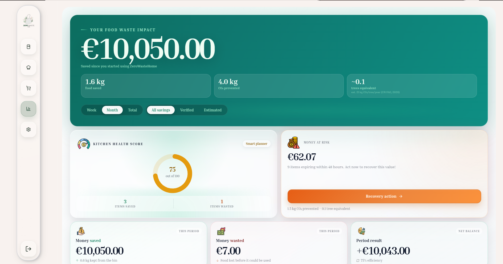
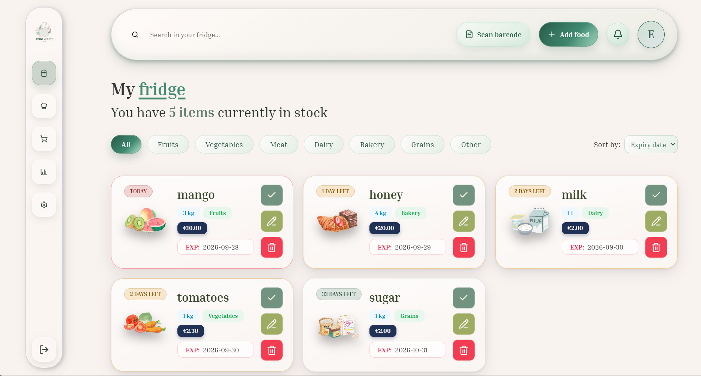
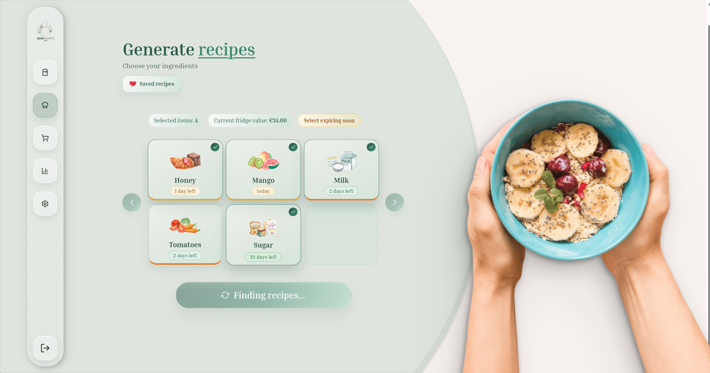
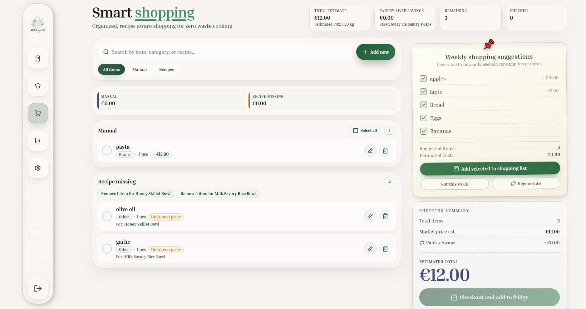

# ZeroWasteHome

A full-stack React + Firebase Progressive Web App for tracking household food inventory, reducing food waste, and quantifying the financial and environmental impact of what gets eaten versus thrown away.

[Live Demo](https://zerowastehome.vercel.app) · [Report a Bug](https://github.com/andreeacrauciuc/zerowastehome/issues)

[](https://react.dev/)
[](https://vitejs.dev/)
[](https://firebase.google.com/)
[](https://sass-lang.com/)
[](https://vitest.dev/)
[](./.github/workflows/quality-checks.yml)
[](./vite.config.js)

---

## Overview

ZeroWasteHome tracks what a household buys, eats, and throws away, then turns that data into something actionable. It supports multi-member households with a real-time shared inventory, AI-generated recipes based on what is actually in the pantry, a shopping list that transfers purchases into inventory in one step, and an analytics dashboard that expresses savings in money, kilograms, and CO₂.

The project runs against real Firebase infrastructure with no mock data layer: Firestore security rules, real-time listeners, transactional writes, and a scheduled Cloud Function for push notifications.

---

## Application Preview

<p align="center">
  
  <br />
  <em>Impact analytics dashboard: lifetime savings, CO₂ prevented, kitchen-health score, and saved-vs-wasted trend.</em>
</p>

<p align="center">
  
  <br />
  <em>Smart Inventory &amp; Barcode Scanner: expiry-aware cards, sorting, and category filters.</em>
</p>

<p align="center">
  
  <br />
  <em>AI Recipe Generator (Groq Llama 3.3): recipes built from current pantry contents.</em>
</p>

<p align="center">
  
  <br />
  <em>Smart Shopping List &amp; One-Tap Checkout: purchased items move into inventory atomically.</em>
</p>

---

## Features

- **Smart inventory.** Add items manually or by barcode scan (ZXing). Track expiry dates, quantities, and units; sort by urgency; filter by category. Cards visually escalate as items approach expiry.
- **AI recipe generation.** Recipes are generated from current pantry contents using Groq (Llama 3.3 70B) through a serverless proxy. Results include ingredient matching, cost estimates, eco-scores, and pantry-swap suggestions.
- **Smart shopping list.** Build and check off a list, then transfer purchased items into inventory in a single atomic operation. Pantry-swap suggestions reduce duplicate purchases.
- **Impact analytics.** Lifetime savings counter, CO₂ prevented, a kitchen-health score, saved-vs-wasted trend chart, top loss categories, and an event timeline.
- **Households.** Create or join a shared household with a 6-character join code. Inventory, shopping, and impact data sync in real time across members.
- **Push notifications.** A scheduled Cloud Function sends FCM expiry reminders with per-user silent hours and automatic cleanup of stale device tokens.
- **Settings.** Profile and avatar management, currency selection, notification preferences, and household management.
- **Installable PWA.** Service worker, Firestore network-first runtime caching, and an install prompt.

---

## Key Engineering Decisions

### Self-healing data scope

Household membership changes (joining, leaving, switching between personal and shared view) are a classic source of orphaned data: documents written under a `householdId` the user no longer belongs to become invisible to everyone. The data layer addresses this in two places:

- **`hooks/dataStore/useFirestoreListeners.js`** attaches `onSnapshot` listeners scoped to either the user's household or their own UID. Scope is resolved only after auth is ready, which avoids race conditions on refresh.
- **`hooks/dataStore/useScopeRepair.js`** detects documents whose `householdId` no longer matches the user's actual membership and repairs them, so data is not stranded when users join or leave a household.

Two related rules support this:

- **Read scope is separate from write scope.** Writes always use the user's real membership, never the current view mode, so items are not written into the wrong scope.
- **Transactional writes.** Checkout, archiving, and household join/leave run inside `runTransaction`. The join flow re-reads the household document before committing.

If a Firestore query is rejected during an auth edge case, the app degrades to `localStorage` with a toast instead of crashing.

### API keys stay on the server

The Groq key is never shipped to the browser. All AI calls go through **`api/groq.js`**, a Vercel Serverless Function that accepts POST only, validates the request body, attaches `GROQ_API_KEY` from the server environment, forwards the request to Groq, and returns the response.

Locally, `vite.config.js` provides an equivalent `/api/groq` dev proxy so development behaves like production. The variable is deliberately declared without a `VITE_` prefix so Vite can never bundle it into the client.

### Row-level security in Firestore

`firestore.rules` requires `request.auth != null` on every operation. A document is accessible only to its `ownerId` or to a verified member of its `householdId`. Membership is verified inside the rule with a `get()` on the household document rather than by trusting a field sent by the client.

### Scheduled expiry notifications

`checkExpiringItems` (`functions/index.js`) is a Firebase v2 scheduled function that runs daily at 09:00 (Europe/Bucharest). It:

1. Queries inventory for items expiring in 2 days.
2. Groups them by household or individual owner and fans out to all member UIDs.
3. Skips users who are inside their configured silent hours (timezone-aware).
4. Sends a multicast push via `sendEachForMulticast`.
5. Inspects the response for unregistered or invalid tokens and removes them with `arrayRemove`.

### Logic in hooks, presentational components

State, side effects, API calls, and derived data live in custom hooks (for example `useDataStore`, `useAddFoodForm`, `useNotificationDrawer`, `useImpactAnalytics`, `useShoppingActions`). Components stay mostly presentational, which keeps the logic testable without rendering UI.

### Styling architecture

Styling is modular SCSS combining several approaches:

- Component-colocated stylesheets (`Inventory.jsx` next to `Inventory.scss`).
- Domain partials for larger stylesheets (`_animations.scss`, `_grid.scss`, `_header.scss`).
- CSS Modules where scoping matters (`ToggleSwitch.module.scss`, `SideBar.module.scss`).
- Global design tokens in `src/styles/`, exposed as SCSS variables and CSS custom properties.

---

## CI/CD

The GitHub Actions workflow (`.github/workflows/quality-checks.yml`) runs on every push and pull request to `main` and `develop` (Node 20).

| Step | Tool | Gate |
|------|------|------|
| Lint | ESLint 9 (flat config, React Hooks rules) | Blocking |
| Unit tests | Vitest + Testing Library | Reported |
| Coverage | Vitest v8 coverage, uploaded to Codecov | Reported |
| Build | Vite production build | Blocking |
| Secret scan | `scripts/ci/check_no_client_keys.js` | Blocking |

The secret scan recursively scans `src/` and fails the build if a client-exposed secret name (`VITE_GROQ_API_KEY`, `VITE_OCR_SPACE_API_KEY`, `VITE_UNSPLASH_KEY`) appears in source. It exists to prevent a server-side secret from being accidentally promoted into the client bundle.

Run the same checks locally before pushing:

```bash
npm run lint && npm run test:run && npm run ci:check-keys && npm run build
```

---

## Project Structure

```text
.
├── api/
│   └── groq.js                 # Vercel Serverless Function: Groq proxy
├── functions/
│   └── index.js                # Firebase Cloud Functions (checkExpiringItems)
├── scripts/
│   └── ci/
│       └── check_no_client_keys.js   # CI secret-scanning gate
├── public/                     # Static assets, PWA icons
├── src/
│   ├── app/                    # Router, provider tree, top-level shell
│   ├── assets/                 # Images and static resources
│   ├── components/             # Shared UI (ErrorBoundary, modals, avatar)
│   ├── constants/              # App-wide constants
│   ├── features/
│   │   ├── auth/               # Auth context, sign-in/register, FCM token registration
│   │   ├── household/          # Household context, join/leave flows
│   │   ├── impact/             # Analytics engine and chart components
│   │   ├── inventory/          # Inventory, FoodCard, AddFoodModal, barcode scanner
│   │   ├── recipes/            # AI recipe generation and ingredient selection
│   │   ├── settings/           # Profile, household, notification, currency panels
│   │   └── shopping/           # Shopping list, checkout, pantry-swap logic
│   ├── firebase/               # Firebase app initialisation
│   ├── hooks/
│   │   ├── dataStore/
│   │   │   ├── useFirestoreListeners.js   # Scoped onSnapshot listeners
│   │   │   └── useScopeRepair.js          # Repairs stranded householdId data
│   │   └── ...                 # App-wide hooks (e.g. useDataStore)
│   ├── layouts/                # Page and shell layouts
│   ├── locales/                # Translation resources
│   ├── services/               # Firebase-facing services (barcode, FCM, data writes)
│   ├── styles/                 # Global design tokens and shared partials
│   ├── test/                   # Test setup and shared test utilities
│   └── utils/                  # Pure helper functions
├── firestore.rules             # Row-level access control
├── vite.config.js              # Vite, PWA plugin, dev proxy
└── .github/workflows/
    └── quality-checks.yml      # CI pipeline
```

---

## Local Setup

### Prerequisites

- Node.js 20 and npm
- A Firebase project with Firestore, Authentication (Email/Password), Storage, and Cloud Messaging enabled

### 1. Clone and install

```bash
git clone https://github.com/andreeacrauciuc/zerowastehome.git
cd zerowastehome
npm install
```

### 2. Configure environment

```bash
cp .env.example .env
```

| Variable | Required | Notes |
|----------|:--------:|-------|
| `VITE_FIREBASE_API_KEY` | Yes | Firebase Web API key (public; safe to expose) |
| `VITE_FIREBASE_AUTH_DOMAIN` | Yes | `<project>.firebaseapp.com` |
| `VITE_FIREBASE_PROJECT_ID` | Yes | Firebase project ID |
| `VITE_FIREBASE_STORAGE_BUCKET` | Yes | Firebase Storage bucket |
| `VITE_FIREBASE_MESSAGING_SENDER_ID` | Yes | FCM sender ID |
| `VITE_FIREBASE_APP_ID` | Yes | Firebase App ID |
| `VITE_FIREBASE_VAPID_KEY` | Yes | Web Push (FCM) VAPID key |
| `GROQ_API_KEY` | Yes | **Server-side only** (no `VITE_` prefix). Read by the dev proxy and the serverless function. |
| `VITE_GROQ_MODEL` | No | Defaults to `llama-3.3-70b-versatile` |
| `VITE_RECIPE_BATCH_SIZE` | No | Number of recipes per generation |

> **On keys:** Firebase web API keys are not secrets. They identify the project in the browser and are protected by Firestore Security Rules. The Groq key is a secret and must stay server-side; the CI secret scan enforces this.

### 3. Deploy Firestore rules

```bash
firebase deploy --only firestore:rules
```

The app depends on these rules for access control and will not behave correctly without them.

### 4. Run

```bash
npm run dev        # http://localhost:5173
npm run build      # production build
npm run preview    # preview the built output
```

### Scripts

```bash
npm run lint           # ESLint
npm run test           # Vitest (watch mode)
npm run test:run       # Vitest (single run, used in CI)
npm run test:coverage  # Coverage report
npm run ci:check-keys  # Secret scan
```

---

## Deployment

The frontend and `api/groq.js` are deployed together on Vercel. Set `GROQ_API_KEY` in the Vercel project's environment variables, along with the `VITE_FIREBASE_*` values. Firestore rules and the Cloud Function are deployed through the Firebase CLI.